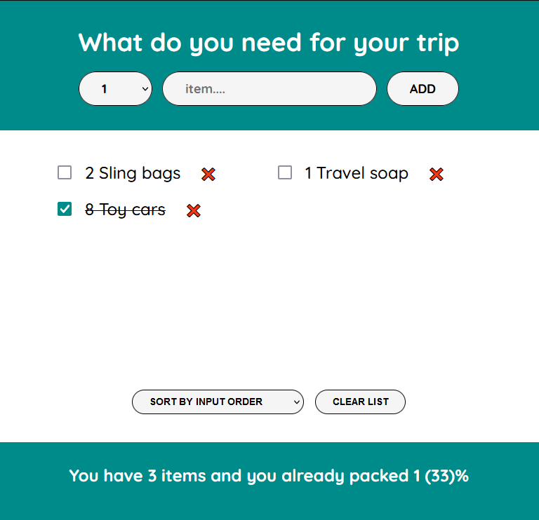

# React - Packing List

# 🔗 [Live Preview]()

---

## About 👋

This React exercise which is for packing list management, practices logic of useState and passing props

---

## Features 👨‍💻

- Item Addition: Controlled components handle quantity and description inputs, ensuring React manages their values. This allows for dynamic updates and validation.

- Interactive Packing: Toggle the packed status of items with checkboxes managed by React's state. Visual cues with strikethrough text enhance user experience.

- Customizable Sorting: Dynamically re-order the displayed items based on your chosen criteria (input order, description, or packed status).

- List Clearing: A dedicated button that triggers a confirmation prompt before clearing the entire list. React then removes all items from the state.

- Informative Footer: Displays the total number of items, packed items, and a percentage completion indicator, all derived from the state using derived state variables.

---

## Explanation 🧠

**1. App Component:**

--- Manages the overall state of the application using useState hooks. This state includes:

- `items`: An array containing objects representing each item (quantity, description, packed status, id).
- `sortBy`: A string indicating the current sorting criteria (input, description, packed).

--- Sends data as props:

The App component renders the `Form` and `PackingList` components.
It passes the following state data as props:

- `items` array to the `PackingList` component for displaying the list.
- `onAddItems` function (handles adding new items) to the `Form` component.
- `onClearList` function (handles clearing the list) to the `PackingList` component.
- `sortBy` string (sorting criteria) and functions to update it (potentially) to the `PackingList` component.

**2. Form Component:**

--- Receives `onAddItems` function as a prop from the App. Handles user input for quantity and description. When the user submits the form:

- It creates a new item object with the entered data and a unique ID (e.g., using `Date.now()`).
- It calls the `onAddItems` function received as a prop, passing the new item object as an argument.

**3. PackingList Component:**

--- Receives `items` array, `onClearList` function, and potentially `sortBy` and sorting update functions as props from the `App`. Displays the list of items using the `Item` component, passing each item object and relevant functions as props. Handles user interactions:

- Calls the `onClearList` function received as a prop when the "Clear list" button is clicked.
- Potentially uses the `sortBy` prop and sorting update functions to manage sorting logic.

**4. Item Component:**

- Receives individual item object, `onDeleteItem` function (for deleting an item), and `onToggleItem` function (for toggling packed status) as props from the `PackingList`. Displays the item's quantity, description, and a checkbox for marking it packed. Handles user interactions:

- Calls the `onDeleteItem` function received as a prop when the delete button is clicked.
- Calls the `onToggleItem` function received as a prop when the checkbox is clicked.

---

## Key Points: 🔑

- The App component acts as a central state manager, holding all the application's core data.
- Data (items, functions) flows down as props from parent (App) to child components (Form, PackingList, Item).
- Child components cannot directly modify the state held by the parent. They trigger updates by calling functions passed as props.
- This unidirectional data flow promotes a well-organized and predictable application structure.

---

## Languages

- React: functions, conditionals, useState, components, props, derived state
- Styling: basic
